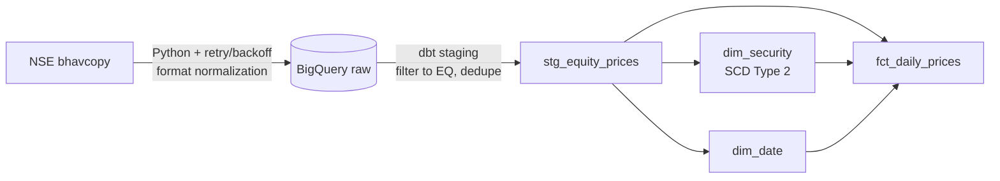
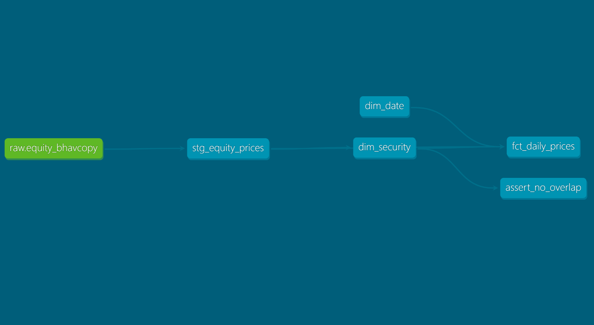

# nse-warehouse

Batch ELT pipeline and dimensional warehouse for NSE (National Stock Exchange
of India) equity daily prices. Python, dbt, BigQuery.

Pulls daily equity bhavcopy data, lands it in BigQuery untouched, then
transforms it into a star schema. Securities are modeled as an SCD Type 2
dimension, so a rename or ISIN change doesn't overwrite history.

## Architecture





## Star schema

| Table | Grain | Notes |
|---|---|---|
| `fct_daily_prices` | one row per security per trading day | OHLC, volume, turnover, trade count |
| `dim_security` | one row per version of a security | SCD Type 2 on name and ISIN |
| `dim_date` | one row per calendar day | pure, generated, no dependency on trading data |

## Design notes

`dim_security` is derived directly in SQL with `LAG`/`LEAD` window functions
instead of a dbt snapshot. The source already has a full day-by-day history,
not a mutating "current state" table, so there's nothing to diff against
over time. A new version starts when a security's name or ISIN changes from
the previous trading day. `assert_no_overlap` is a custom test that
self-joins `dim_security` and checks no security ever ends up with two
versions covering conflicting date ranges.

`fct_daily_prices` joins to both dimensions with `LEFT JOIN`. If a join ever
failed to match, a `LEFT JOIN` keeps the row with a null key instead of
silently dropping it from the fact table.

NSE switched its bhavcopy format on 2024-07-08, the UDiFF rollout, a
SEBI-mandated change. Old files use different column names and don't include
a company name field at all. Ingestion detects which format a given day is
in and renames old columns to match the new ones before loading, so both
eras sit in one consistent raw table. Rows from before the switch get the
ticker symbol as a placeholder name, flagged explicitly with a
`name_is_placeholder` column rather than mixed in with real ones.

A few things I considered and didn't do: backfilling today's names onto old
rows (misrepresents what was actually true at the time), pulling in a second
NSE feed just for historical rename events (probably exists somewhere, not
worth the scope here), and routing the column mapping through an LLM. The
mapping is a small, fully known lookup with no ambiguity for a model to
resolve. An agentic approach would just add latency and non-determinism to
a problem that's already solved.

One thing that shows up in the data: `dim_security` has a cluster of about
1,900 version starts on 2024-07-08. Not a bug. Every security's name changed
that day, from the ticker placeholder to its real name from the new format.

## Scale

- Date range: 2023-01-02 to 2026-06-30, 864 distinct trading days
- Raw layer: about 2.48M rows
- `fct_daily_prices`: about 1.74M rows. Row count matches
  `stg_equity_prices` exactly, so the temporal join to `dim_security` isn't
  fanning out.
- `dim_security`: about 5,300 rows across roughly 2,900 distinct securities

## Testing

Generic dbt tests: `not_null` and `unique` on primary keys, `relationships`
tests checking every foreign key in `fct_daily_prices` resolves to a real
row in its dimension.

One custom test, `assert_no_overlap`, checks that no security in
`dim_security` ends up with two versions covering overlapping dates, which
would mean the SCD2 logic produced two "currently true" versions at once.

## Setup

Requires a GCP project with BigQuery enabled, the `gcloud` CLI authenticated
via Application Default Credentials, and Python 3.12+.

```bash
uv venv
source .venv/bin/activate
uv pip install nse tenacity pandas google-cloud-bigquery dbt-core dbt-bigquery

gcloud auth application-default login

# adjust the date range in ingest_bhavcopy.py's __main__ block, then:
python ingest_bhavcopy.py

cd nse_warehouse_dbt
dbt deps
dbt run
dbt test
```

## Known limitations

Ingestion isn't idempotent. Running it again for a date range that's
already loaded creates duplicate rows in raw. Dedup happens on purpose in
staging, not at ingestion.

Security names before 2024-07-08 are placeholders, not real company names,
since the old bhavcopy format didn't include one. Flagged via
`name_is_placeholder`.

Sector and index membership aren't modeled. Not in NSE's bhavcopy, would
need a separate source.

Delivery quantity isn't modeled either. It's in a separate NSE report this
project doesn't ingest.

`dim_security` assumes the ticker symbol is a stable anchor for a
security's identity. A rename that also changed the ticker would show up as
two disconnected securities instead of one continuous history. Didn't
happen in the data ingested here, but nothing structurally prevents it.